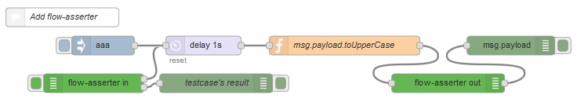
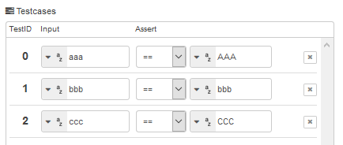
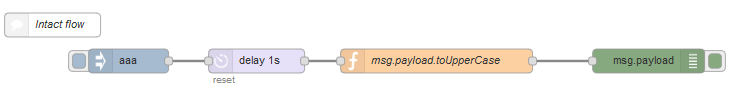
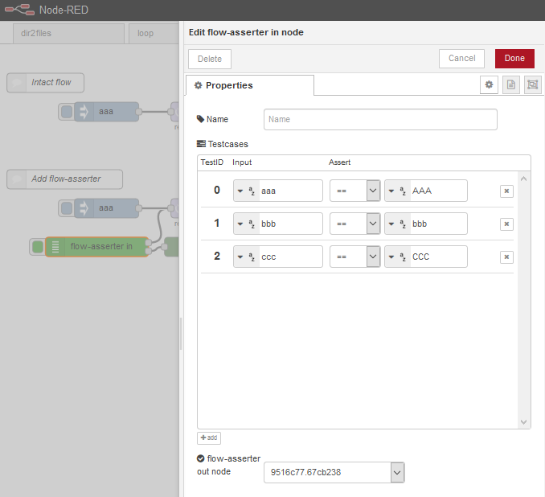
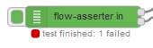
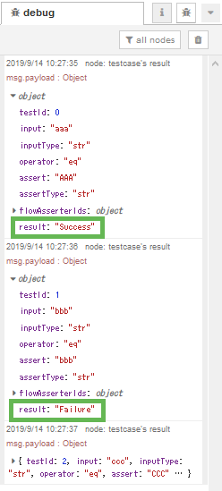

node-red-contrib-flow-asserter
====

Node-RED nodes to help testing your flow on editor UI. Testcases which need input and how to evaluate output are written in the editor dialog of the node. Writing testcases is easy because it is similar to setting inject node or switch node.

## Description

This module has 2 nodes, **flow-asserter in node** and **flow-asserter out node**.

  


Testcases are written in flow-asserter in node and flow-asserter out node is inserted into flow at the point wanted to assert <code>msg.payload</code>. By clicking the button, test will start. Each testcase stores its input in <code>msg.payload</code> and sends a message from the upper output port. When the message reaches flow-asserter out node specified by flow-asserter in node, <code>msg.payload</code> is compared with testcase's output by the rule defined in testcase and result of that comparison is sent from the lower output port.

## Usage

Following example flow is in examples/example.json.  
Drag & drop in your Node-RED editor.

1. Prepare the test object flow.  
In this example, the flow consists of inject node, delay node, function node and debug node. This flow sends string, converts `msg.payload` to uppercase and display string stored in `msg.payload`.

1. **Flow-asserter out node** is dragged over the mid-point of a wire which links between function node and debug node. The reason is we want to ensure the letters becoming the uppercase.
1. Add **flow-asserter in node** to the workspace. The upper output port of flow-asserter in node is wired to the input port of delay node and the lower output port is wired to the input port of debug node which is newly added.

1. Open the edit dialog of flow-asserter in node. Push add button 3 times. Fill input and output column. Second row of testcases, testID 1, will fails. Finally select flow-asserter out node's ID at the buttom of the dialog.

1. Save and close the dialog. In workspace click the button of flow-asserter in node. Test will start, node status is displayed and testcase's result is displayed in debug sidebar. Second testcase, testID 1, will be failure and the others will be success.  
  


## Install

```
npm install node-red-contrib-flow-asserter
```

[](https://nodei.co/npm/node-red-contrib-flow-asserter/)

## Changelog

[Changelog](https://github.com/s1r-J/node-red-contrib-flow-asserter/blob/master/CHANGELOG.md)

## Licence

[Apache-2.0](http://www.apache.org/licenses/LICENSE-2.0.html)

## Author

[s1r-J](https://github.com/s1r-J)