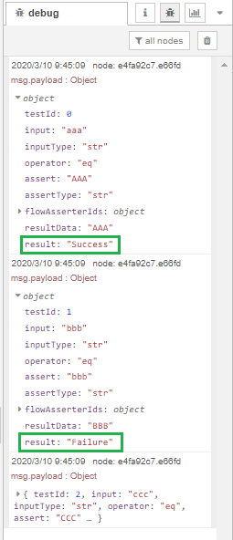

node-red-contrib-flow-asserter
====

このモジュールは、Node-REDエディタUI上でフローの実行テストを支援するノードモジュールです。

## Description

node-red-contrib-flow-asserterは、Node-REDのフローをエディタ上でテストすることを支援するノードモジュールです。

Node-REDを利用するとき、ユーザはエディタ上でいくつかのノードをつなぎ合わせてフローを作成します。
そして、多くのユーザはフローが自分の思った処理をしてくれているかテストを行なうでしょう。  
このとき、どのようにテストを実行していますか？Injectノードのボタンを押してはDebugノードで確認し、値を変えてもう一度、という具合でしょうか？場合によってはテスト中に不必要なフローが実行されないようにDebugノードの直前のノードのワイヤーを付け替えることもあるでしょう。さらに、一旦本番利用を始めてからもフローを修正したときには、再度全ての値でテストを繰り返す必要が出てくるかもしれません。いずれにせよ、Node-REDではフローをテストしようとした際には非常に煩わしいことになります。

このモジュールはそのようなフローテストの煩わしさを解消します。node-red-contrib-flow-asserterの特徴は2つあります。

1. 1回のボタンクリックで複数のテストケースを実行することができる
2. テスト実行時は値をアサートしたい位置以降のフローにメッセージが送られない

1つ目の特徴によってユーザはテストのために何度もInjectノードの値を書き換える必要がなくなります。


上図のように複数のテストケースをノードの編集ダイアログで記述します。テストケースには入力値、値の検証方法、そして出力値を設定します。値の検証方法は単純な`==`のほかに大なり小なり、[fast-deep-equal](https://www.npmjs.com/package/fast-deep-equal)モジュールを利用した`equals`などがあります。このように値を設定したテストケースを複数用意することで1回の操作で全て実行することができます。

2つ目の特徴はテスト実行時と本番実行時を切り替える際にフローを修正する手間を省くことに繋がります。下図はこのノードを利用した簡単なフローです。


このモジュールには**Flow-asserter inノード**（ボタン付きのノード）と**Flow-asserter outノード**（入力ポートと出力ポートが1つずつあるノード）という2つのノードが含まれています。  
Flow-asserter inノードのボタンをクリックすることでテストが実行され、テストケースの入力値がペイロードに代入されたメッセージオブジェクトが上側のポートから送出されます。メッセージはDelayノード、Functionノードを介してFlow-asserter outノードに到達します。すると、Flow-asserter outノードはメッセージを自身の出力ポートに繋がっているDebugノードに**送らず**、代わりに値を検証します。検証結果はFlow-asserter inノードの下側のポートから送られます。  
では、テスト以外で実行した場合にはどうなるでしょうか？先程の例で説明すると、Injectノードのボタンを押すと、Delayノード、Functionノードを介してFlow-asserter outノードに到達しますが、ここでは値の検証は**実施せず**、直後のDebugノードにメッセージを**そのまま送出します**。

## Usage

以下で説明しているフロー例は、このリポジトリの`examples/example.json`のものです。  
エディタにドラッグ&ドロップすることでインポートすることができます。

1. テスト対象のフローを用意します。  
この例では、フローはInjectノード、Delayノード、Functionノード、そしてDebugノードから構成されてます。このフローはInjectノードから送られてきた文字列を大文字に変換し、Debugサイドバーに表示します。


1. **Flow-asserter out**ノードはFunctionノードとDebugノードの間のワイヤーの中間点にドラッグオーバーします。この位置にoutノードを配置することで、フローが文字列が正しく大文字に変換できているかを確認することができます。

1. **Flow-asserter in**ノードをワークスペースに追加します。inノードは2つの出力ポートを持っているため、上側の出力ポートをDelayノードに接続し、下側は新たに追加したDebugノード（`testcase's result`）に接続します。


1. Flow-asserter inノードの編集ダイアログを開きます。今回は3つのテストケースを作成するため、追加ボタンを3回押します。図のように入力値、出力値を設定します。値の検証方法（`Assert`）は今回変更する必要はありません。テストケースの2行目、TestID 1は失敗となるはずです。最後にダイアログの最下部でFlow-asserter outノードのノードIDを選択します。


1. 完了ボタンを押してダイアログを閉じます。エディタ上のFlow-asserter inノードのボタンをクリックしてみましょう。するとテストが開始され、ノードステータスが表示され、デバッグサイドバーにもテストケースの結果が表示されます。予想通り、2列目（TestID 1）のテストケースは失敗となり、その他は成功となりました。
  


1. テスト実行時のメッセージの動きを確認しましょう。Flow-asserter inノードのボタンをクリックすると、編集ダイアログで設定した1行目のテストケースが実行されます。テストケースの入力値は`msg.payload`に代入されて上側の出力ポートからメッセージが送られます。Flow-asserter outノードに到達すると、メッセージは出力ポートに接続されているDebugノードには送られず、Flow-asserter inノードに送られ、テストケースの記述に沿って値の検証が行なわれます。検証結果はFlow-asserter inノードの下側の出力ポートから送出されます。同時に2行目のテストケースが実行されます。すべてのテストケースが実行されるまでこれが繰り返されます。

1. 最後に念の為、テストではない通常実行時の動きを確認します。Injectノードのボタンをクリックすると、設定済の値が`msg.payload`に代入されてメッセージが送られます。途中でFlow-asserter outノードにメッセージが到達しますがテスト実行中ではないため、何も処理をおこなうことなく出力ポートに接続されているDebugノードにメッセージを受け渡します。

## Install

```
npm install node-red-contrib-flow-asserter
```

[](https://nodei.co/npm/node-red-contrib-flow-asserter/)

## Changelog

[Changelog](https://github.com/s1r-J/node-red-contrib-flow-asserter/blob/master/CHANGELOG.md)

## Licence

[Apache-2.0](http://www.apache.org/licenses/LICENSE-2.0.html)

## Author

[s1r-J](https://github.com/s1r-J)

## Languages

[English](./README.md)
